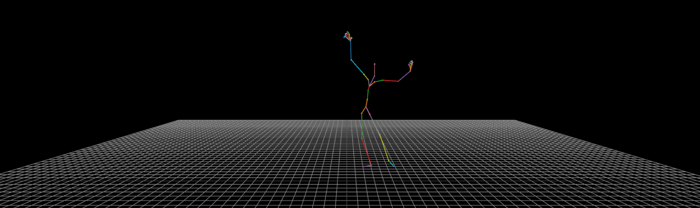
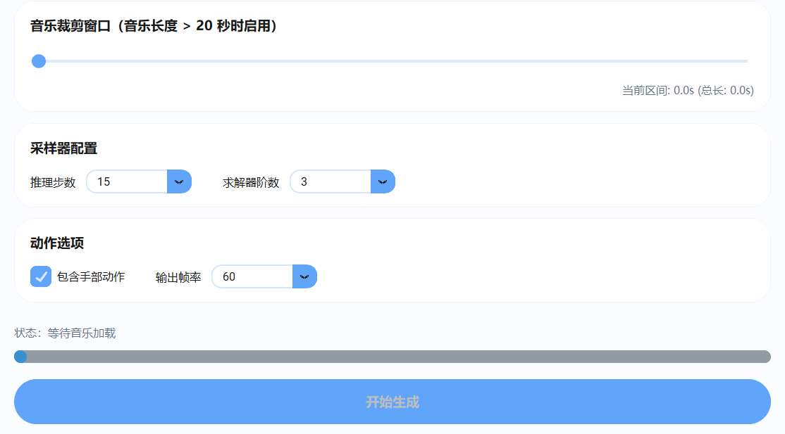

 
# Music2Dance AI Studio

[👉下载最新版本应用👈](https://github.com/laytonzjl/Music2Dance-AI-Studio/releases/tag/v1.1.0)

**[简体中文](#简体中文)** | **[English Version](#english-version)**

*“生的光荣 死的伟大”*

# 简体中文

## 📖 项目概述

**M2D AI Studio** 是一个专为游戏开发人员、动画师及 3D 内容创作者打造的端侧多模态舞蹈动作生成软件。输入音乐（目前最长支持20秒），该软件就能进行高效的舞蹈动作生成，实现从音乐到 BVH 动作资产的一键式转换。

## 🚀 快速上手说明
1. **获取应用**：访问 [Releases](https://github.com/laytonzjl/Music2Dance-AI-Studio/releases) 页面下载最新的安装程序。
2. **环境准备**：软件已完成自动化封装，无需预先安装 Python 或 CUDA，直接安装运行即可。
3. **音频预处理**：尽量选择音质清晰、节拍明显的音频片段。若音频过长，请使用窗口裁剪功能限定 20 秒内的生成范围。
4. **导出规范**：生成的 BVH 文件支持直接拖拽至 Blender 或者其他引擎，执行重定向（Retargeting）操作即可应用到角色模型。

## ⚙️ 技术特性
* **CPU推理**：~~无需 GPU 加速即可在普通桌面 CPU 上实现高效推理。~~ 现已支持切换GPU加速！
* **帧数选择**：支持 30FPS/60FPS 动作输出，兼容主流 3D 引擎。
* **手部动作**：支持生成精细化的手部动作。
* **可视动画**：支持在浏览器中可视化生成结果。

## 🛠 参数详解
| 参数名称 | 建议设置 | 说明 |
| :--- | :--- | :--- |
| **推理步数** | 15 - 30 | 值越高动作细节越丰富，但生成时间随之增加。 |
| **求解器阶数** | 3 | 阶数越高，扩散迭代过程越准确，推荐保持3。 |
| **手部动作** | 开启 | 包含手部关节数据，适用于精细的艺术动画需求。 |
| **可视动画** | 开启 | 在浏览器中可视化生成结果。 |
| **输出帧率** | 60 | 推荐 60FPS 以保证动画平滑。 |

## ⚠️ 局限性
* **架构限制**：本软件采用轻量化架构，旨在满足个人开发者对于快速动作原型验证的需求。
* **生成质量**：鉴于数据集规模及端侧算力部署要求，本软件的生成质量与动作精细度**无法等同于高算力商业级动作生成引擎**，目前仅适用于基础动作资产的快速生成测试。
* **资产局限**：软件内嵌的资产库规模有限，对于极其复杂、动态多变的舞蹈动作序列，可能出现生成结果与预期存在偏差的情况，这属于本软件目前的版本技术边界。

## ❓ FAQ
* **Q: 为什么生成的动作在某些角色上看起来有“漂移”？**
  * A: 动作漂移通常源于根骨骼（Root/Pelvis）的偏移。请在动作重定向时，检查并固定根骨骼的高度偏移量。
* **Q: 程序运行时占用内存较高？**
  * A: 动作生成过程中会加载完整的模型权重，建议预留 4GB 以上的系统空闲内存。
* **Q: 是否支持批量处理？**
  * A: 本版本为单次推理模式，批量自动化功能将在后续迭代中更新。

## 🙏 鸣谢
本项目引用并受益于以下优秀开源工作：
* **训练数据**：[FineDance](https://github.com/Finedance-dataset) 提供的舞蹈动作基准。
* **人体模型**：[SMPL-X](https://github.com/vchoutas/smplx) 提供的人体参数化模型。
* **算法参考**：[EDGE](https://github.com/chahuja/EDGE), [DDPM](https://github.com/hojonathanho/diffusion), [IDDPM](https://github.com/openai/improved-diffusion), [DPM-Solver](https://github.com/LuChengTHU/dpm-solver)

## ⚠️ 警示
本项目仅限用于**非营利性的科研测试与学习交流**，严禁将本工具用于任何商业产品的开发或营利性行为。

---

# English Version

## 📖 Project Overview
**M2D AI Studio** is an edge-side multimodal dance motion generation software designed for game developers, animators, and 3D content creators. By inputting music (currently supporting up to 20 seconds), the software leverages diffusion models for efficient dance motion generation, enabling one-click conversion from music to BVH motion assets.

## 🚀 Quick Start
1. **Get the App**: Visit the [Releases page](https://github.com/laytonzjl/Music2Dance-AI-Studio/releases/tag/v1.0.0-alpha) to download the latest installer.
2. **Environment**: The software is fully packaged; no prior installation of Python or CUDA is required.
3. **Audio Preprocessing**: Choose clear audio with distinct beats. For audio longer than 20 seconds, use the cropping feature to limit the generation to 20 seconds.
4. **Export Specification**: Generated BVH files support direct import into Blender's action library. Simply perform retargeting to apply them to your character models.

## ⚙️ Technical Features
* **CPU Inference**: Efficient inference on standard desktop CPUs without the need for GPU acceleration.
* **Frame Selection**: Supports 30FPS/60FPS output, compatible with major 3D engines.
* **Hand Motion**: Supports generation of refined hand movements.

## 🛠 Parameter Details
| Parameter | Suggested Setting | Description |
| :--- | :--- | :--- |
| **Inference Steps** | 15 - 30 | Higher values yield more detail but take longer to generate. |
| **Solver Order** | 3 | Higher order improves smoothness of diffusion iteration; 3 is recommended. |
| **Hand Motion** | Enabled | Includes hand joint data, suitable for artistic animation needs. |
| **Output FPS** | 60 | 60FPS is recommended for smooth animation in UE5 or Unity. |

## ⚠️ System Limitations & Function Disclaimer
* **Lightweight Architecture**: Designed as a lightweight edge-side system to facilitate rapid prototype verification for individual developers.
* **Generation Quality Boundary**: Due to model weights being limited by open-source datasets and edge-side compute constraints, generation quality **is not equivalent to high-compute commercial motion engines**. It is intended for basic motion asset generation testing only.
* **Asset Limitations**: The embedded asset library has a limited scope. For highly complex or dynamic dance sequences, deviations between generated results and expectations may occur; this is within the current technical boundaries.

## ❓ FAQ
* **Q: Why does the motion appear to "drift" on some characters?**
  * A: Motion drift is usually caused by the offset of the Root/Pelvis bone. Please check and fix the height offset of the root bone during retargeting.
* **Q: Why is memory usage high during execution?**
  * A: The motion generation process loads full model weights. We recommend reserving at least 4GB of free system memory.
* **Q: Is batch processing supported?**
  * A: This version is single-inference mode. Batch automation will be updated in future iterations.

## 🙏 Acknowledgments
This project references and benefits from the following open-source works:
* **Dataset**: [FineDance](https://github.com/Finedance-dataset)
* **Algorithms**: [EDGE](https://github.com/chahuja/EDGE), [DDPM](https://github.com/hojonathanho/diffusion), [IDDPM](https://github.com/openai/improved-diffusion), [DPM-Solver](https://github.com/LuChengTHU/dpm-solver)

## ⚠️ Copyright Notice
This project is strictly for **non-profit research, testing, and educational purposes**. Commercial use of this tool for product development or profit-making activities without permission is strictly prohibited.

---

